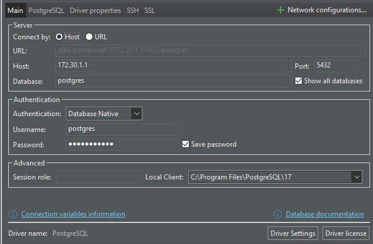

# Introduction

## Install postgresql

Let's pick latest release 17.0 to experiment with new features later on.

Using Windows 10 Pro and wsl Ubuntu 22.04 LTS distributive.

`lsb_release -a`

```
No LSB modules are available.     
Distributor ID: Ubuntu
Description:    Ubuntu 22.04.3 LTS
Release:        22.04
Codename:       jammy
```

Installation process from postgresql repo

Register repo
```
sudo apt update
sudo sh -c 'echo "deb http://apt.postgresql.org/pub/repos/apt $(lsb_release -cs)-pgdg main" > /etc/apt/sources.list.d/pgdg.list'
curl -fsSL https://www.postgresql.org/media/keys/ACCC4CF8.asc | sudo gpg --dearmor -o /etc/apt/trusted.gpg.d/postgresql.gpg
sudo apt update
```

Install and run + ensure it runs when wsl is rebooted
```
sudo apt install postgresql-17
sudo systemctl start postgresql
sudo systemctl enable postgresql
```

Check that all goes as it should `psql --version` results in `psql (PostgreSQL) 17.0 (Ubuntu 17.0-1.pgdg22.04+1)`

Change configuration to listen for all address (lazy to determine the windows localhost address from wsl)

```
sudo nano /etc/postgresql/17/main/postgresql.conf
listen_addresses = '*'
```

Setup md5 password auth (really have to check what that means)
```
sudo sed -i '/^host/s/ident/md5/' /etc/postgresql/17/main/pg_hba.conf
sudo sed -i '/^local/s/peer/trust/' /etc/postgresql/17/main/pg_hba.conf
echo "host all all all md5" | sudo tee -a /etc/postgresql/17/main/pg_hba.conf
```

Restart postgresql
```
sudo systemctl restart postgresql
```

Allow firewall port
```
sudo ufw allow 5432/tcp
```

Setup password
```
sudo -u postgres psql
ALTER USER postgres PASSWORD 'aristovrule';
\q
sudo systemctl restart postgresql
```


Now connect from [DBeaver](https://dbeaver.io/). Not perfect but works for most databases.

Install postgresql 17.0 client (cli tools) for windows [www.enterprisedb.com](https://www.enterprisedb.com/downloads/postgres-postgresql-downloads), no need to install pgadmin / the server itself (we have it under Ubuntu). Select it manually while configuring the connection

From windows PS `wsl hostname -I` results in `172.30.1.1`

Some troubleshooting

Check that we can connect to wsl from windows (PS) `Test-NetConnection -Port 5432 -ComputerName 172.30.1.1 -InformationLevel Detailed`
```
ComputerName            : 172.30.1.1
RemoteAddress           : 172.30.1.1
RemotePort              : 5432
NameResolutionResults   : 172.30.1.1
MatchingIPsecRules      :
NetworkIsolationContext : Internet
IsAdmin                 : False
InterfaceAlias          : vEthernet (WSL)
SourceAddress           : 172.30.0.1
NetRoute (NextHop)      : 0.0.0.0
TcpTestSucceeded        : True
```

From wsl check that we enabled connections

```
sudo nano /etc/postgresql/12/main/pg_hba.conf
```

Add line `host all all all md5` (for all users we can connect from anywhere to all databases with md5 sumcheck). Reload conf so that the service can stay online
```
sudo -u postgres psql
select pg_reload_conf();
\q
```

Windows can change wsl local IP after reboot, always ensure it with `wsl hostname -I`. Or make a [proxy to it](https://superuser.com/questions/1582234/make-ip-address-of-wsl2-static).

In the end your DBeaver connection shall look like



## Download

Download example dataset and let it create a database with records
```
wget https://storage.googleapis.com/thaibus/thai_small.tar.gz && tar -xf thai_small.tar.gz

psql -U postgres < thai.sql
```

## Result

In DBeaver

```
select count(*) from book.tickets
```

results `5185505`


